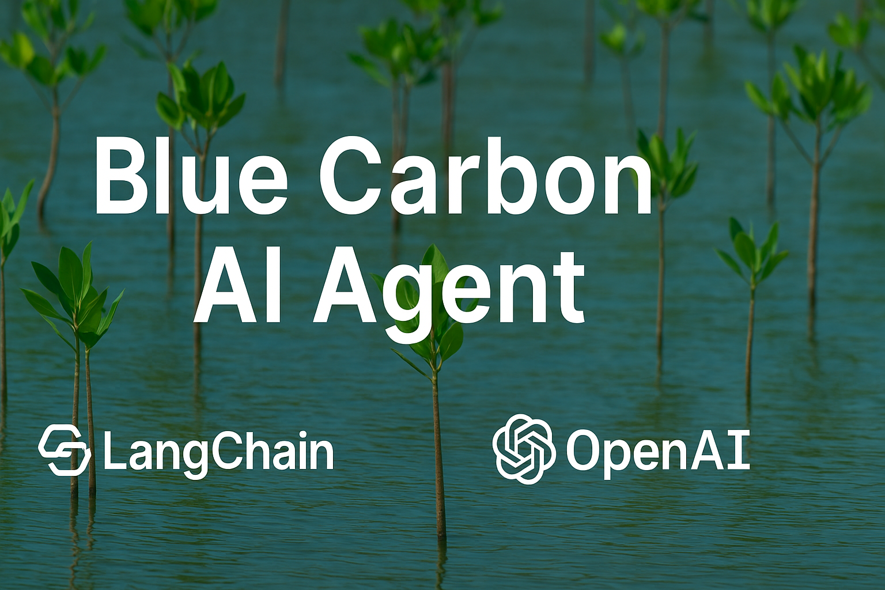

  

<h1 align="center">🌊🌳 Blue Carbon AI Agent</h1>

  <b>An Intelligent RAG-based Assistant trained on “Blue Carbon” by Stefaine Simpson & Lindsey Smart (The Nature Conservancy, Aug 2024)</b>
   
  <a href="#-overview">Overview</a> •
  <a href="#-features">Features</a> •
  <a href="#-example-interaction">Example</a> •
  <a href="#-author">Author</a>
    
  
  
  
  
  

---

## 🌍 Overview

**Blue Carbon AI Agent** is a **Retrieval-Augmented Generation (RAG)** assistant built to explore and summarize insights from  
> _“Blue Carbon” by Stefaine Simpson and Lindsey Smart (The Nature Conservancy, August 2024)._  

It uses **OpenAI**, **LangChain**, and **Chroma** to process and query the book’s contents — allowing users to interact naturally with the text and obtain technically grounded answers about carbon storage, measurement methodologies, and conservation strategies.  

If no relevant information is found, the AI responds transparently:  
> “I can’t tell you that.”

---

## ⚡ Features
✅ RAG pipeline with local vector database  
✅ Contextual responses generated through OpenAI GPT models  
✅ Modular and lightweight implementation  
✅ Powered by LangChain’s latest modular ecosystem  
✅ Fully offline retriever with persistent Chroma storage  

---

## 💬 Example Interaction
Below is a **real example** of a question and the AI’s full contextual response — generated from the book’s content and related scientific context.

**Write your question: Qual é a melhor prática atual para obter dados de COS?**

**AI response:**

> **Resposta:**  
> A melhor prática atual para obter dados de COS é coletar amostras físicas do solo e enviá-las a um laboratório de solo credenciado para análise.  
>
> **Por que é assim:**  
> - Fornece dados diretos de COS e de mudanças de estoque, essenciais para a integridade de créditos de carbono.  
> - Dados locais tendem a ser mais precisos e podem gerar mais créditos do que usar apenas padrões nacionais conservadores.  
> - Embora caro e demorado, é o mais confiável para demonstrar a qualidade dos projetos de carbono.  
>
> **Como aplicar (principais pontos operacionais):**  
> - **Desenho de amostragem:** adote uma amostragem aleatória estratificada dentro da área do projeto. Divida a área em estratos homogêneos para reduzir a variabilidade entre estratos.  
> - **Intensidade amostral:** defina o número de amostras por unidade de área dentro de cada estrato para equilibrar custos de amostragem e reduções de créditos por erros amostrais.  
> - **Dados coletados:** profundidade do solo, densidade do solo seco e teor de carbono orgânico (%Corg). Estoques de COS são calculados a partir da densidade seca total multiplicada pelo %Corg (e pela profundidade relevante).  
> - **Frequência de medição:** medir o COS no início do projeto e, pelo menos, a cada 5 anos ao longo da vida do projeto.  
> - **Métodos de laboratório:** o método de combustão seca (via analisador elementar) oferece uma medida quantitativa de carbono; métodos alternativos como LOI (perda na ignição) e Walkley-Black são mais baratos e menos diretos, porém semiquantitativos e com limitações. Em prática de alta qualidade, o método de combustão seca é preferível.  
> - **Considerações de custo e qualidade:** reconheça que o custo pode ser uma barreira; investimentos em pesquisa para reduzir custos de medição podem aumentar a geração de créditos de alta qualidade.  

---

## 🌱 About the Book

> *Blue Carbon* explores how coastal ecosystems — including mangroves, seagrasses, and salt marshes — store vast amounts of carbon and play a critical role in climate regulation.  
> This project transforms the scientific insights from that book into an **interactive AI knowledge assistant** for sustainability professionals, researchers, and environmental students.

---

## 🧑‍💻 Author

**Fábio Souza**  
Geographer & Data Scientist
🌎 Specialized in Geospatial Intelligence, AI, and Environmental Innovation  
📧 [LinkedIn](www.linkedin.com/in/fabio-ribeiro-de-souza-60007710)

---

## 📄 License

This project is intended for **educational and research purposes only**.  
All rights to the book *“Blue Carbon”* belong to **The Nature Conservancy** and the authors **Stefaine Simpson & Lindsey Smart**.

---

  <i>“Science, data, and AI — driving sustainability through knowledge.”</i>

